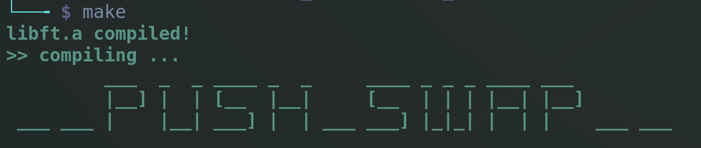
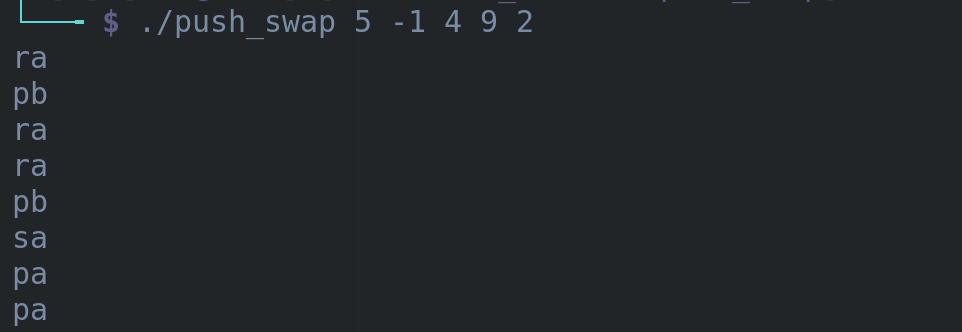
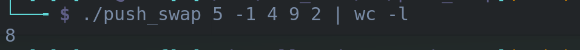
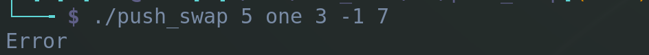

# Radix sorting algorithm

## Description

This program uses implementation of radix sort to sort positive and negative
numbers in ascending order with the least instructions (moves) possible,
specifically for set of 100 and 500 numbers, with following limitations:

- only system calls are allowed (read, write, malloc, free, exit)
- no global variables
- using only 2 stacks (A and B)
- allowed operations to sort:
    - sa  -> swap first two elements at the top of stack A
    - pa  -> push element from stack B to stack A
    - ra  -> move element from top to bottom of stack A 
    - rra -> move element from bottom to top of stack A 
    - sb  -> swap first two elements at the top of stack B
    - pb  -> push element from stack A to stack B
    - rb  -> move element from top to bottom of stack B 
    - rrb -> move element from bottom to top of stack B 

Program will print to the terminal names of operations carried out to sort the stack.

## Installation

To install the program run command below:

```bash
make
```

## Usage

```bash

# set values as a variable
NUMBER_SET="34 2 13 -6"

# pass the values into the program and return number of operations
./push_swap $NUMBER_SET | wc -l

# or

./push_swap 34 2 13 -6 | wc -l

# both return value 6 [number of operations to sort the stack]

```

```bash
# remove program and all object files
make fclean
```

## Examples

Installing ..
<br>


Usage
<br>

<br>


Handling errors
<br>

